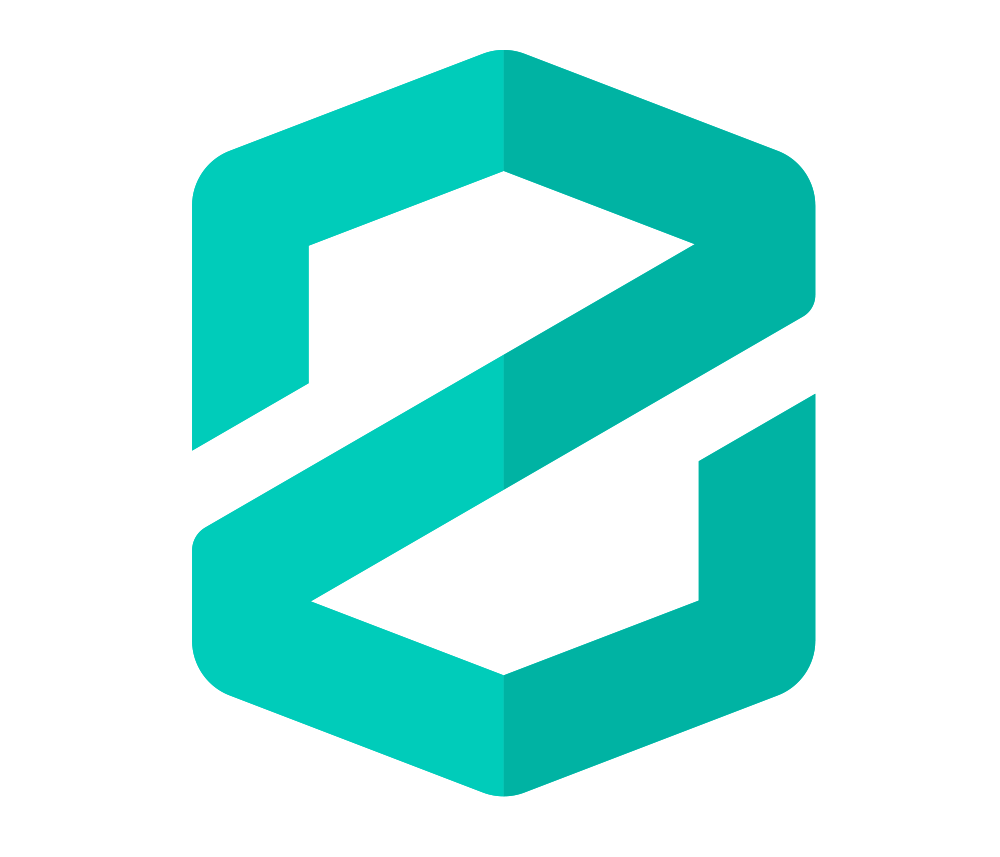
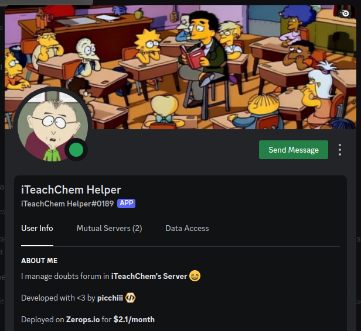

# iTeachChem Helper
**iTeachChem Helper** is a discord bot that manages the Doubt forums in [iTeachChem](https://discord.gg/9m3EvgnxKK) Server. Bot is hosted on [Zerops](https://zerops.io)
> The source code here is only for educational purposes.

### Self Hosting this on Zerops
1. Go to [Zerops](https://zerops.io) and sign up
2. Go to [Zerops Dashboard](https://app.zerops.io/dashboard/projects) and navigate to import project button.
3. Paste the import project yaml and then go to the service and setup envs.

<a href="https://zerops.io">
    
</a>
<a href="https://discordpy.readthedocs.io/en/stable/">
 
</a>

## Features
<div style="text-align: center;">
    
</div>
iTeachChem Helper provides a lot of features to help in Forum channels such as:

```
- Individual Subject pings. 
- Command to mark the thread as "Solved" when the doubt is resolved.
- Points given to users who help in resolving doubts. 
- Support to organise quizzes in the server. 
- Leaderboard to keep track of stats of users. 
- Commands to keep track of your recent asked doubts. 
```
## User commands
| Command | Description |
| :---: | --- |
| `+solved @user1 @user2...` | Marks the thread as **Solved** and further locks it. Points are given to the users mentioned. |
| `+stats` | Returns your stats i.e. Doubts solved, Questions solved. Mention the user with the command to get their stats |
| `+lb` | Returns the Leaderboard. |
| `+threads` | Returns your last 15 asked Doubt posts. |

and many more...

### Want to Contribute?
Contributions are always welcome. Kindly open an issue first for discussion.

You can also join the [iTeachChem](https://discord.gg/9m3EvgnxKK) server too for discussion.

